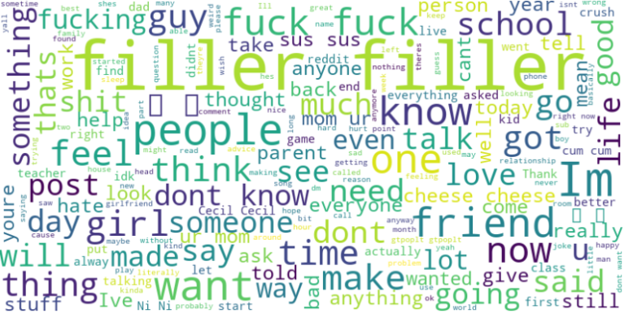
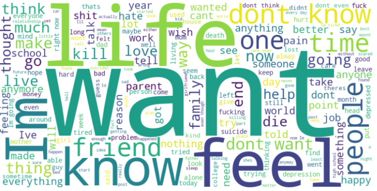
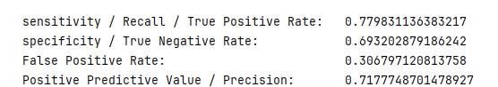

# NLP Project: Suicide Detection from Reddit Data! 
 This NLP project focuses on detecting suicide-related content from text data collected from Reddit. The project involves various preprocessing techniques, TF-IDF vectorization, and machine-learning models for text classification.

## Dataset
The dataset used in this project is named "Suicide_Detection.csv" and is collected from Reddit. It contains text data related to suicide posts or discussions. The dataset is stored in a CSV file format and is loaded into a Pandas DataFrame for analysis and modeling.

 ### Cloud World for Non_Suicide text:
   

 ### Cloud World for Suicide text:
   

 ### Frequency of some words in both datasets:
 We see a clear difference in terms of frequency. 
 Remarque that the words have sentimental connotations, and that they are heavily used in suicide-related comments.
 
| Words | Occurrences in Suicide data| Occurrences in Non_Suicide data |
| --------------- | --------------- | --------------- |
| want1   | 127104   | 20143    |
| life    | 106606   | 8830    |
| feel    | 107149   | 14250    |
| suicide    | 32331   | 773    |
| need    | 27715   | 10438    |
| tak    | 67216   | 9124    |

 ## Project Overview
1. Data Overview:
  * Reads the dataset using Pandas and displays information about the DataFrame.
  * Removes unnecessary columns and checks for null values and duplicates.
  * Prints the count of each class in the dataset.
2. Preprocessing:
  * Converts the text data to lowercase.
  * Removes punctuation and special characters from the text.
  * Removes stop words from the text using NLTK's stopwords list.
3. Tokenization:
  * Worked with TF-IDF as well as GPT2-Tokenizer from HuggingFace.
  * Each tokenizer was used for a different model.
5. Models:
  * Splits the data into training and testing sets.
  * Trains a VotingClassifier, which combines three Naive Bayes classifiers (GaussianNB, BernoulliNB, and MultinomialNB) using soft voting.
  * Evaluates the performance of the VotingClassifier on both training and testing sets.
  * Trains an SVM (Support Vector Machine) classifier using scikit-learn's SVC.
  * Evaluates the performance of the SVM model on both training and testing sets.
  * Saves the trained models using pickle for future use.
  * Developed a Sequential model using TensorFlow.

## Neural Net Evaluation
To evaluate the model, I used Sensitivity, Specificity, and some more metrics.
 ### threshold:
I played around with the decision threshold to find the best value that balances the Sensitivity and the Specificity. I find the best value to be "O.45".
### Report:

For the threshold of 0.45, I manually calculated the evaluation metrics:

This is the report generated by Tensorflow:

## Conclusion
This NLP project demonstrates the process of preprocessing text data, converting it into numerical features using TF-IDF vectorization, and training machine learning models for text classification. The goal of the project is to detect suicide-related content from Reddit data. By following the steps in the Jupyter Notebook, you can analyze the dataset, train the models, and make predictions on new text inputs.
For more details, refer to the provided Jupyter Notebook file and the code comments within it.  
